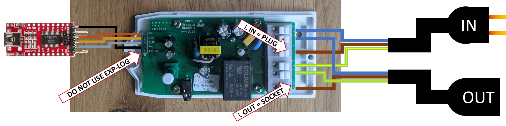

# BierBot Bricks

BierBot Bricks is a combination of brewing soft- and hardware that helps you to nail your temperatures (by controlling your heating and cooling equipment), monitor your gravity during fermentation, and much more. Everything is available on a beautiful website that works perfectly on all display sizes: [bricks.bierbot.com](https://bricks.bierbot.com).

If you get stuck along the way, please dont hesitate to [reach out](https://github.com/BernhardSchlegel/BierBot-Brick/discussions/new) - you're not alone and we're happy to help! If you 👍 it, please consider giving this repo a **star** 🌟 - THANKS!

If you need more flexibility and have time to build your own RaspberryPi based solution, checkout the [BierBot Bricks software for RaspberryPi](https://github.com/BernhardSchlegel/BierBot-Bricks-RaspberryPi).

## Setup for easy use

There is a [YouTube-Video](https://www.youtube.com/watch?v=ZJEo5KyGwx4) that shows you how to build your Brick step-by-step. There is also a [detailled howto guide including many pictures](https://docs.bierbot.com/hardware/hardware/brick-101#how-to-build-you-own-bierbot-brick) available on the official documentation. 

In the following, you'll find a description that is boiled down to the most important steps.

First, we need to flash the firmware.

1. Order a Sonoff [TH16 + DS18B20 Temperature sensor](https://amzn.to/3uhLiXN).
2. In case you don't have one laying around, you'll also need:
   1. [FT232RL USB to TTL](https://amzn.to/3ujiT3w) for flashing the BierBot Brick firmware onto your TH16. **Make sure the jumper is set to 3.3V**.
   2. [the cheapest female rainbow cables you can find on the WWW](https://amzn.to/3udmdh2) to hook the TH16 and the FT232 up.
   3. [a 4x1 pin header](https://amzn.to/3rXGrJT) to solder it onto your TH16. 
3. Hook everything up as shown in the image below (left side). 
4. Download the [NodeMCU Flasher](https://github.com/nodemcu/nodemcu-flasher).
6. Grab the (current) release from [here](https://github.com/BernhardSchlegel/BierBot-Brick/releases/latest).
7. Open the NodeMCU Flasher
      1. Select tab "Config", and paste the filename of the binary you've just downloaded 
         into the first line ("firmware.bin") or select one using the dots on the right. 
         ESP8266Flasher.exe and the firmware.bin must be located in the same directory.
      2. Press the button on your TH16 (and hold it), connect the FT232RL, release the button. 
      2. Select tab "Operation" and hit "Flash"!

Second, read [the disclaimer](#disclaimer) and cut a extension cable into two pieces and connect as shown in the picture (right side). 
**ATTENTION** :warning: check if the labels on YOUR PCB match the colors of the cables: L = Brown, 
N = Blue, E / Ground symbol = Yellow / Green. L IN must go to your plug, L OUT to your socket.

Your device is now ready to be used. 😃😤

Go to [bricks.bierbot.com](https://bricks.bierbot.com/#/) > "Brewery" > "Bricks" and hit "Add device". Copy the API-Key 
into your clipboard. Power up your BierBot Brick. Scan for the "BierBot Brick 101" WiFi and connect. Enter 
the credentials to your home WiFi and paste the API-key from your clipboard. Hit "Save". 

**DONE**. The BierBot Brick should show up in your dashboard.

## Help

For general questions please use [Github Discussions](https://github.com/BernhardSchlegel/BierBot-Brick/discussions).

If you think you found a bug or want to request a feature: 
[Submit an issue](https://github.com/BernhardSchlegel/BierBot-Brick/issues/new/choose).

In any case: Thanks for participating!

## Developer

The information in this section is only relevant if you want to participate in development.

### Developer Setup

1. Install VSCode from [here](https://code.visualstudio.com/).
2. Install PlatformIO as described [here](https://platformio.org/).
3. Install driver for your Serial converter. E.g. from [here](https://ftdichip.com/drivers/vcp-drivers/).
4. connect your TTL Converter to the Sonoff TH 16. If all cables are in a row, you likely did something wrong. 
5. Click the terminal Icon in the footer bar of VSCode saying "PlatformIO: new terminal" & type `pio lib install`.
6. Click the alien on the right side > "Project Tasks" > "sonoff_th" > "Build" and then "Upload".

### Notes for devs

To decode stacktraces use `python3 ./decoder.py -e ./firmware.elf ./trace.txt -s` from [here](https://github.com/janLo/EspArduinoExceptionDecoder).

If you get a bunch of WiFi Manager related compiling messages, unzip 
"./backup/2021_01_15_16_39_WiFiManager.zip" to ".pio/libdeps/sonoff_th". 

### TODOs

- [ ] Reduce programm size to 50% FLASH so that OTA update works. Blocked by
      [this](https://github.com/tzapu/WiFiManager/issues/1240).
- [ ] set WiFiManager to a fixed version in Platform IO dependencies as soon as 
      a stable version is released.
- [ ] as soon as ESP8266 supports SSL without hardcoding fingerprints: Enable SSL.

## Disclaimer

:warning: **DANGER OF ELECTROCUTION** :warning:

If your device connects to mains electricity (AC power) there is danger of electrocution if not installed properly. If you don't know how to install it, please call an electrician (***Beware:*** certain countries prohibit installation without a licensed electrician present). Remember: _**SAFETY FIRST**_. It is not worth the risk to yourself, your family and your home if you don't know exactly what you are doing. Never tinker or try to flash a device using the serial programming interface while it is connected to MAINS ELECTRICITY (AC power).

We don't take any responsibility nor liability for using this software nor for the installation or any tips, advice, videos, etc. given by any member of this site or any related site.

[disclaimer source](https://github.com/arendst/Tasmota/edit/development/README.md)

